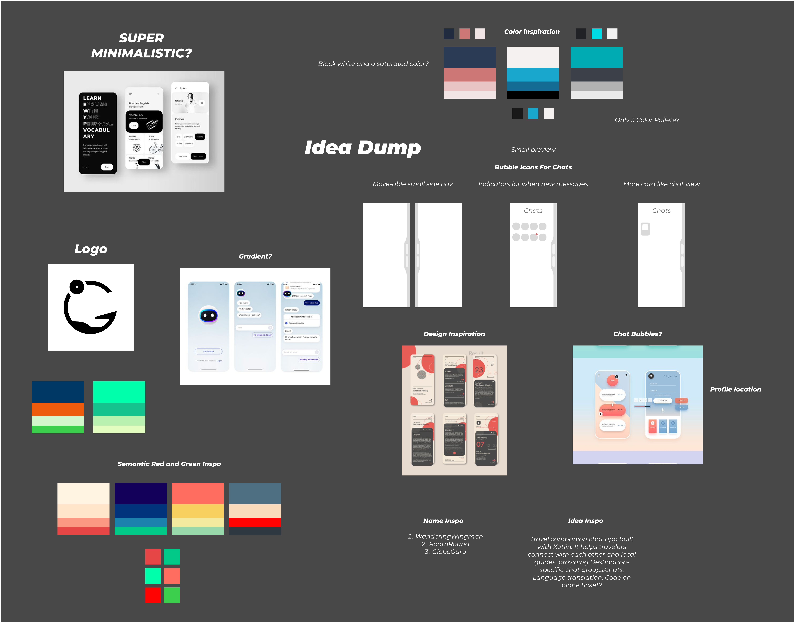
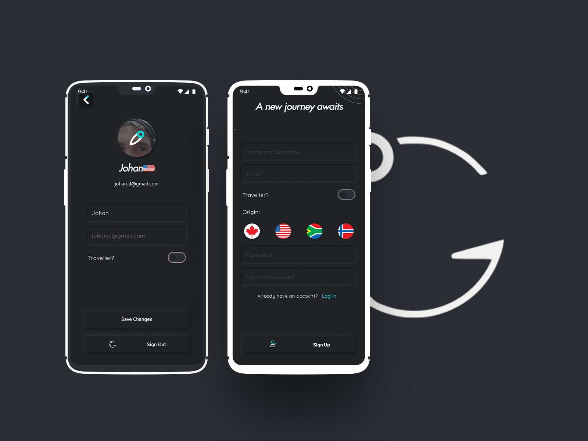
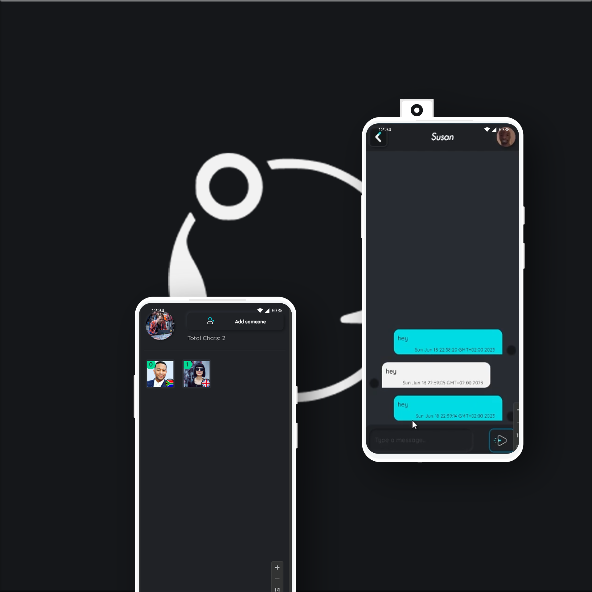

  
  <h1>GlobeGuru</h1>
  
  

Introducing Recipe Rumble, a unique chat application designed specifically for individuals planning international travel. Seamlessly connect with people at your destination by simply entering the connect code found on your plane ticket. The app caters to both travelers and non-travelers, ensuring a diverse and engaging user base. Start exciting conversations and forge connections with like-minded individuals, whether you're exploring new cultures or seeking local insights. With Recipe Rumble, your journey becomes even more enriching and interactive.  

  
  
<!-- Badges -->

  
  
  
  
  
  

  

 

<!-- Table of Contents -->

# :notebook_with_decorative_cover: Table of Contents

- [About the Project](#star2-about-the-project)
  - [Screenshots](#camera-screenshots)
  - [Tech Stack](#space_invader-tech-stack)
  - [Features](#dart-features)
  - [Color Reference](#art-color-reference)
- [Getting Started](#toolbox-getting-started)
  - [Prerequisites](#bangbang-prerequisites)
  - [Installation](#gear-installation)
  - [Run Locally](#running-run-locally)
  - [Deployment](#triangular_flag_on_post-deployment)
- [Roadmap](#compass-roadmap)
- [FinalProduct](#Final-Product)
- [Contributing](#wave-contributing)
  - [Code of Conduct](#scroll-code-of-conduct)
- [License](#warning-license)
- [Contact](#handshake-contact)
- [Acknowledgements](#gem-acknowledgements)

<!-- About the Project -->

## :: About the Project

<!-- Screenshots -->

### :: Idea Dump

 
  

### :: Moodboard

 
  

### :art: Color Reference

| Color        | Hex                                                              |
| ------------ | ---------------------------------------------------------------- |
| Primary Blue |  #00668B |
| Gray         |  #202226 |
| LightGray    |  #2A2D33 |
| DarkGray     |  #15171A |

# :: Final Product

 
  

 
  

<!-- Contributing -->

## :wave: Contributing

<!-- Code of Conduct -->

### :scroll: Code of Conduct

Please read the [Code of Conduct](https://github.com/EpicBlue1/GlobeGuru/blob/master/CODE_OF_CONDUCT.md)

<!-- License -->

## :warning: License

Distributed under the no License. See LICENSE.txt for more information.

<!-- Contact -->

## :handshake: Contact

Project Link: [https://github.com/EpicBlue1/GlobeGuru](https://github.com/EpicBlue1/GlobeGuru)

<!-- Acknowledgments -->

## :gem: Acknowledgements

Use this section to mention useful resources and libraries that you have used in your projects.

- [Awesome README](https://github.com/matiassingers/awesome-readme)
- [Readme Template](https://github.com/othneildrew/Best-README-Template)
